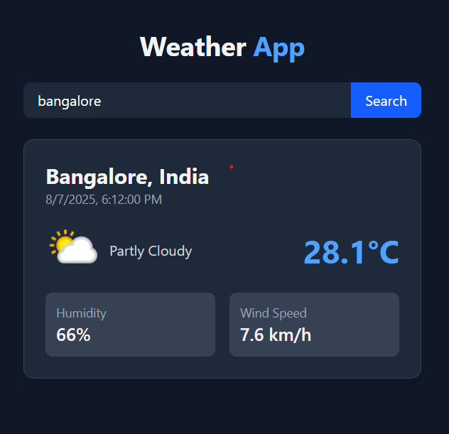

# 🌦️ WeatherWise - Real-Time Weather App

## 🚀 Live Demo
[](https://as1fx.github.io/weather-app-react-tailwindcss)  
*Hosted on GitHub Pages*




A sleek, dark-themed weather application built with React, Vite, and Tailwind CSS. Get real-time weather data for any city worldwide.

## ✨ Features
- 🔍 Type-as-you-search city lookup
- 🌡️ Real-time temperature in °C
- 💧 Humidity and wind speed metrics
- 🌤️ Animated weather condition icons
- 📱 Fully responsive design
- 🎨 Dark/light mode ready

## 🛠️ Tech Stack
<div align="center">
  
| Technology | Purpose |
|------------|---------|
|  | Frontend framework |
|  | Blazing fast builds |
|  | CSS utility classes |
|  | Weather data API |

</div>

## 🏁 Getting Started

### Prerequisites
```bash
Node.js >= 16.x
npm >= 8.x
